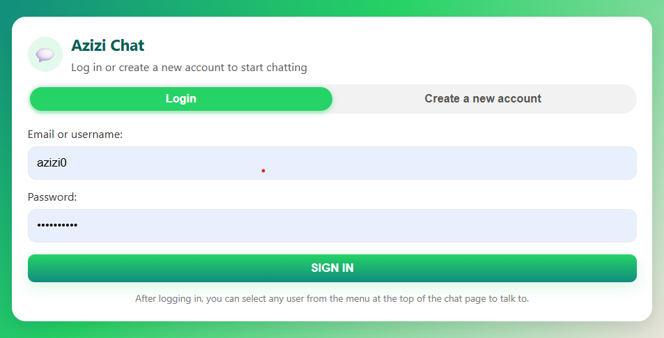
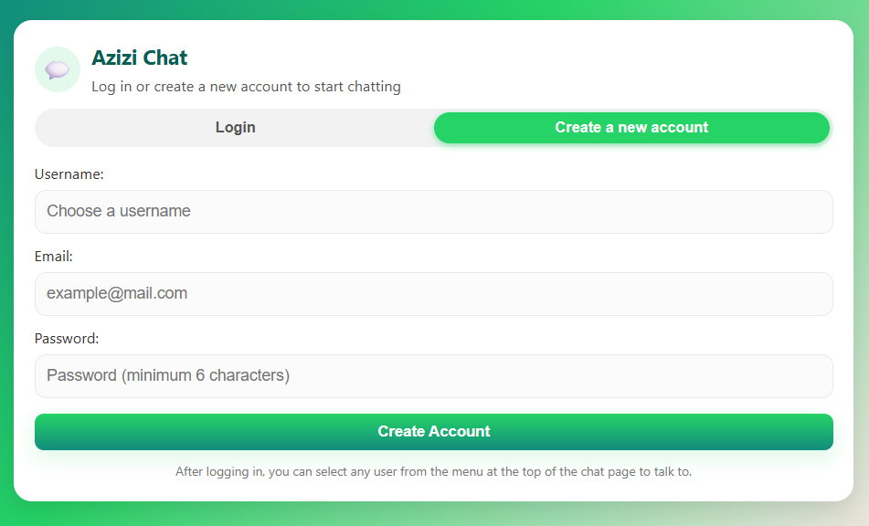

# AziziChat

A full-stack real-time chat application built using modern web technologies.  
It allows users to communicate instantly, manage contacts, and store messages securely.

---

## 🌐 Live Demo

AziziChat is currently deployed on Render:

https://azizichat.onrender.com

## 🚀 Features

- User registration and login
- Real-time messaging using Socket.IO
- Contact list management
- Message storage in database
- Last login tracking
- Secure password hashing

---

## 🛠️ Tech Stack

**Frontend:**
- HTML
- CSS
- JavaScript

**Backend:**
- Node.js
- Express.js
- Socket.IO

**Database:**
- Neon PostgreSQL

**Email Verification:**
- Resend API

**Security:**
- bcrypt
- Helmet
- dotenv

**Deployment:**
- Render
- GitHub

---

## 📸 Screenshots

### Login Page


### Register Page


## ⚙️ How to Run Locally

```bash
git clone https://github.com/azizi12084/AziziChat.git
cd AziziChat
npm install
node server.js
```


## 📊 Project Status

The application is currently live on Render and uses Neon PostgreSQL as the production database.

The previous Azure deployment is no longer active because it was used only for development and testing.

## 💡 What I Learned

- Full-stack development  
- Real-time communication  
- REST APIs  
- Database management  
- Docker  
- CI/CD  
